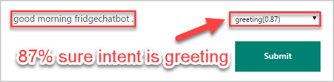
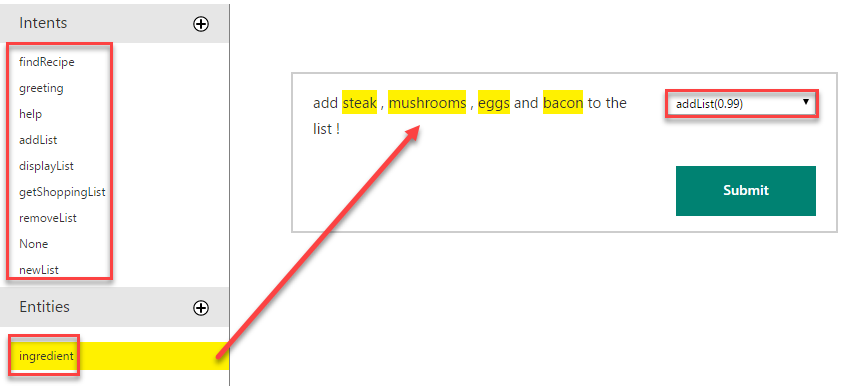
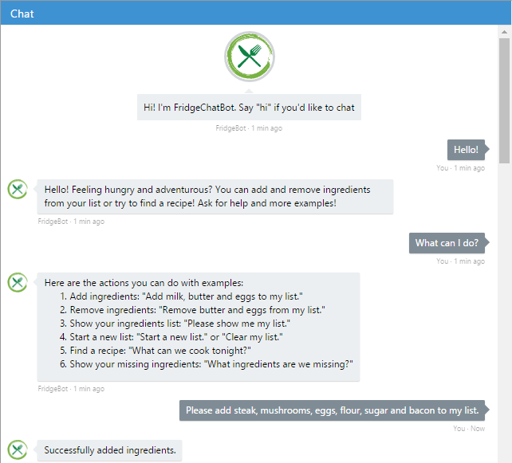
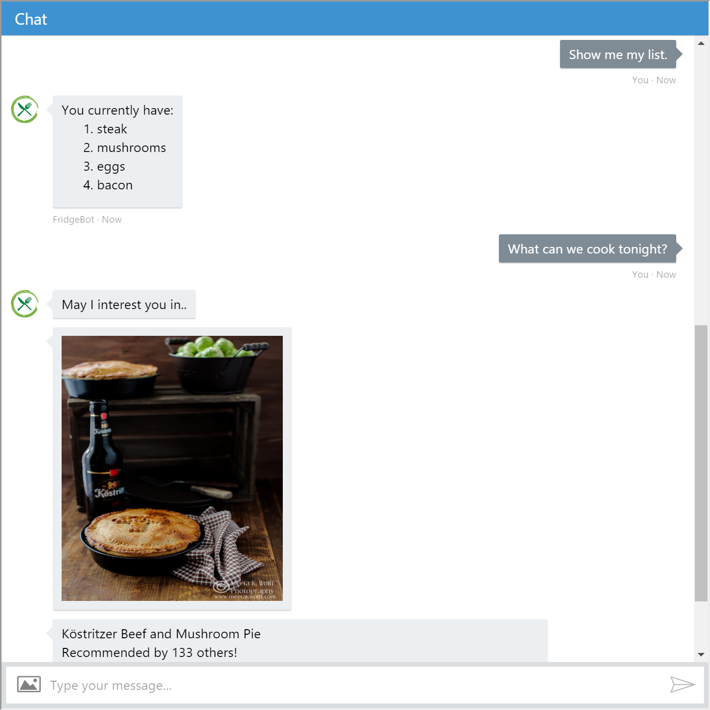
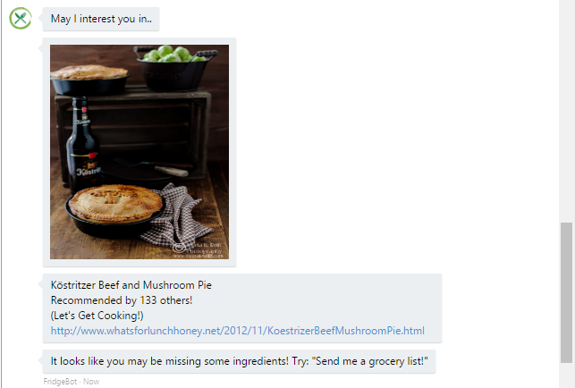
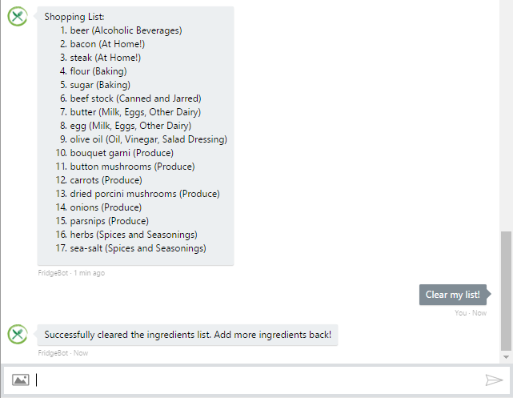

#  FridgeChatBot

### Microsoft Bot Framework (C# .NET) with LUIS.ai integration

ChatBot that helps you make decisions on what to cook for your next meal. The bot takes ingredients that you have at home, or would like to cook with and offers recipes with ratings, links and pictures. Once you decide on a recipe, it can send you a grocery list so you know exactly what to buy! This bot can even retain the state of your grocery list.

Feel free to download this repo and try it on your local machine. All you have to do is provide your own keys in the Web.Config!

## FridgeChatBot Code Breakdown
I break down different key parts of this bot to help you understand how you can make one of your own!

For more information and official documentation, please visit [BotFrameworkDocumentation](https://docs.botframework.com/en-us/).

### Hide your secrets with Web.Config
Ensure that you store any valuable keys in your Web.Config file. These keys should not be leaked to the public, as others can use your keys and consume all of your credits! However, your keys are needed throughout your code in other files, so how do you access them and still keep them safe?

Within your Web.config you can add key value pairs. Now all of your super secret keys are all neat in one file! Just make sure to hide this file! (especially if you are using GitHub, see note below)
```
<configuration>
  <appSettings>
    <!-- update these with your BotId, Microsoft App Id and your Microsoft App Password-->
    <add key="BotId" value="FridgeBot" />
    <add key="Mashape_Key_Kevin" value="<Key HERE>" />
    <add key="MicrosoftAppId" value="<Key HERE>" />
    <add key="MicrosoftAppPassword" value="<Key HERE>" />
    <add key="MicrosoftLUISId" value = "<Key HERE>" />
    <add key="MicrosoftLUISKey" value="<Key HERE>" />
  </appSettings>
  
  <!-- Other Code -->
  
</configuration>
```

Within your source code, all you need to do to access these keys is:
```
using System.Web.Configuration;

string LUISId = WebConfigurationManager.AppSettings["MicrosoftLUISId"]
```
This will return the string value of the specified key. 

**Note: If you are using a Github repository, make sure to include a .gitignore containing your Web.Config file so no one can find your keys!**

Q: What is a .gitignore?

A: .gitignore is a special file with a list of project files and directories that you are EXPLICITLY telling GitHub to exclude from your repository. This allows you to keep certain files/directories private and not public. Check out my .gitignore file for an example. (notice my Web.Config is visible in this repo).

## Integrate LUIS for a smarter Bot
### LUIS Overview
Language Understanding Intelligent Service (LUIS) is a great way to make your bot smarter and ready to handle various inputs from your users. LUIS breaks down each phrase or input statement and determines the intent and any defined entities within the utterance. These intents and entities, mixed with a little control flow logic, can really help your bot understand what the user is asking, and respond accordingly. It is almost imposible to code for every user input, there are just too many possibilities!

Example: How many ways can you think of to greet someone? Hello, Hi, What's Up?, Hiya, Good Morning! ... They all mean the same thing! The intent is all the same! LUIS handles and takes care of the heavy lifting for you and just returns what you need.



Now we have our intents, lets add an entitiy: ingredients. We can train LUIS to identify which words are ingredients entities. After a bit of training, LUIS is smart enough to know what intent the utterance belongs to, and if there are any entities!



```
Rootobject luisObj = await LUISClient.ParseUserInput(activity.Text);
```
This Rootobject luisObj now holds the intents and entities of your user's input. Now that we know what happens behind the scnes when we call the LUIS API, let's see how we can combine a little control flow to utilize them and drive our conversation.

A LuisModel class is used to call the LUIS API, deserialize the object and return a class Rootobject.
```
public class Rootobject
    {
        public string query { get; set; }
        public Intent[] intents { get; set; }
        public Entity[] entities { get; set; }
    }

    public class Intent
    {
        public string intent { get; set; }
        public float score { get; set; }
    }

    public class Entity
    {
        public string entity { get; set; }
        public string type { get; set; }
        public int startIndex { get; set; }
        public int endIndex { get; set; }
        public float score { get; set; }
    }
```
See FridgeChatBot/LuisModel.cs for reference.

**Note: LuisModel.cs is refereced from https://github.com/jennifermarsman/MicrosoftCareerBot - Credit goes to @jennifermarsman**

### LUIS Intents
Our Rootojbect luisObj makes it nice and easy for us to access our intents! It's just a class property. LUIS will return the list of intents into the luisObj.intents array sorted based on the confident percentage (highest confidence will be at index 0). First we check if any intents were returned (safe programming), next we take the first index which will have the highest confident level intent. We assume LUIS is smart enough and this intent is correct. Once we have the intent string, we can use a switch case flow to direct the conversation accordingly.
```
if (luisObj.intents.Length > 0)
{
  switch (luisObj.intents[0].intent) // assumption: first intent is highest score
  {
    case "":
      answer = "I'm sorry. I didn't understand that. You can add and remove ingredients from your list or try to find a recipe!";
      break;

    case "greeting":
      answer = "Hello! Feeling hungry and adventurous? Ask for help and more examples!";
      break;
    
    case "help":
      // do something when intent is "help"
      break;
    case "addList":
      // do something when intent is "addList"
      break;
    case "removeList":
      // do something when intent is "removeList"
      break;
    case "displayList":
      // do something when intent is "displayList"
      break;
    ...
  }
  // Return response back to the user
  Activity reply = activity.CreateReply(answer);
  await connector.Conversations.ReplyToActivityAsync(reply);
}
```
### LUIS Entities
Similar to the intent array, our entities are stored almost the same way. Because luisObj.entities is an array of class Entity (which has many properties), we must iterate through the array and store all of the property entity, which is the string of the ingredient we are interested in. Iterating through, we collect all of the strings and store them in our own string[] items. 
```
// create array to hold entities
string[] items = new string[luisObj.entities.Length];

// parse the entities and pass in
for (int i = 0; i < luisObj.entities.Length; i++)
{
  items[i] = luisObj.entities[i].entity;
}
```
We now have all of the LUIS identified entities in our local variable. Next we will pass these entities along to our StateList manager to add and store the strings.

## Retain State
We utilize a simple file System.IO to read and write to a file.txt. This is a very simple solution to maintaining state. The StateList class has four main methods which are abstracted from the MessagesController. Add and Remove methods are passed in the string[] items which we gathered above, containing all of the entiteis LUIS identified. Without LUIS, we would have to parse each string manually and identify if there are any ingredients. This would involve crosschecking with a database of ingredients which will be very expensive. Using LUIS also don't confine our users from entering inputs in a specific format. They are free to enter whatever and however they want! This allows a better and seemless user experience.

```
internal void AddIngredients(string[] ingredients)
internal void RemoveIngredients(string[] Unwantedingredients)
internal string[] ReadIngredients()
internal void clearIngredients()
```

Alterative solutions: 
* local database using Entity Framework
* Azure Easy Tables
* Azure Blob Storage

## DEMO Time!
http://fridgechatbot.azurewebsites.net/

Check out the live bot yourself! Below is an example conversation you can have with FridgeChatBot to help you keep track of ingredients and find a recipe. If you get a pizza number... we ran out of API calls. Try again tomorrow if that happens!




