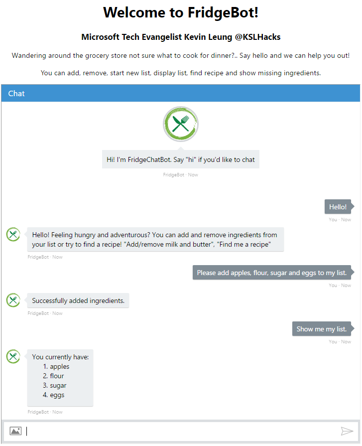
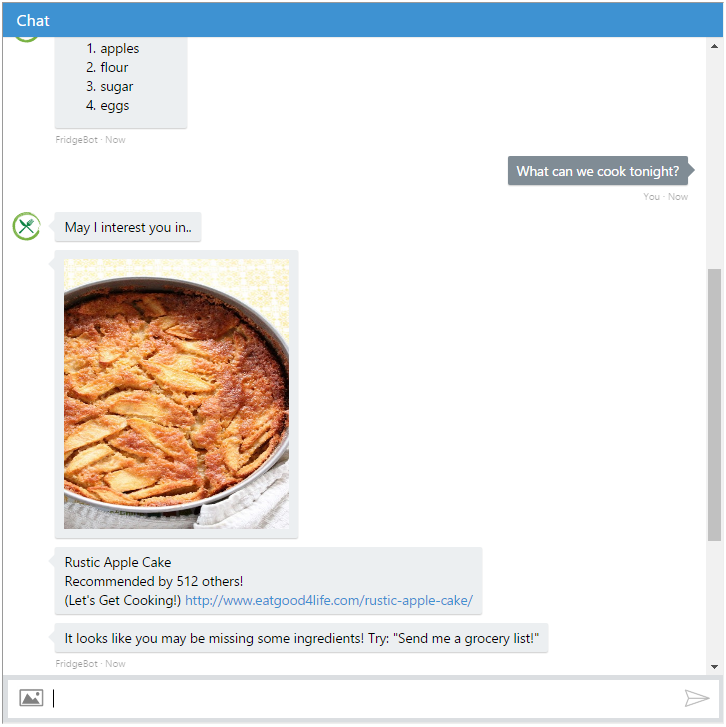
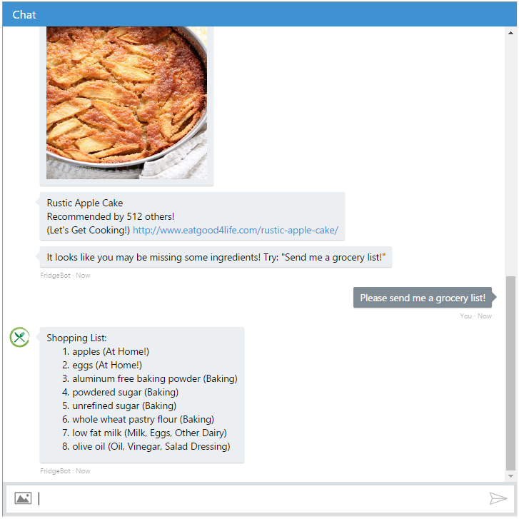
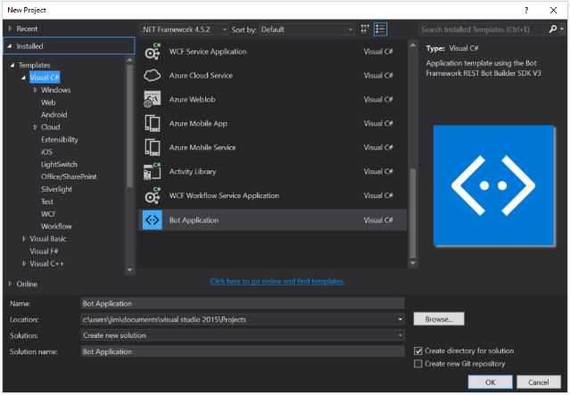
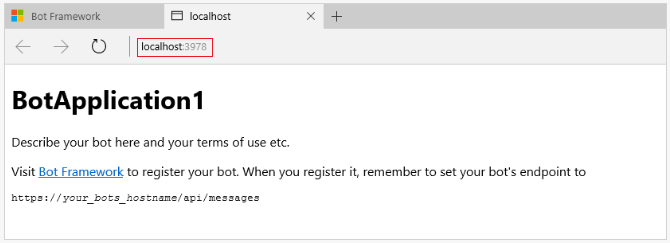
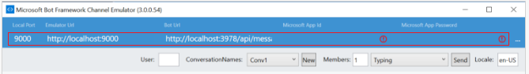
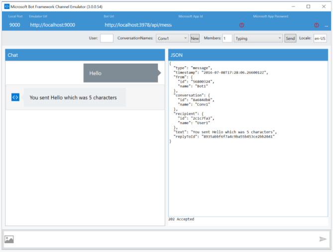

#  FridgeChatBot
### Microsoft Bot Framework (C# .NET) with LUIS.ai integration.

ChatBot that helps you make decisions on what to cook for your next meal. The bot takes ingredients that you have at home, or would like to cook with and offers recipes with ratings, links and pictures. Once you decide on a recipe, it can send you a grocery list so you know exactly what to buy! This bot can even retain the state of your grocery list.





## Walk Through Basic .NET Bot with LUIS (Intents and Entities)
FridgeChatBot was created to show what is possible with the Microsoft Bot Framework using C# .NET and the steps it takes to get it created and up and running! We walk through the basics steps of setup and customization using Language Understanding Intelligent Service (LUIS). This walkthrough will cover creating a basic C# chatbot, as well as code explainations for FridgeChatBot.

### Prerequisite: Everything we need to set up our ChatBot!
* [Visual Studio (Community Edition)](https://www.visualstudio.com/vs/) - Great IDE for our project code
* [Microsoft account](http://accounts.microsoft.com) - Access LUIS.ai and Bot Framework Account
* [Microsoft Azure Subscription](http://azure.com) – A free trial is sufficient
* [Microsoft Bot Framework Channel Emulator](https://docs.botframework.com/en-us/tools/bot-framework-emulator/#navtitle) - Test our Bot
* [Microsoft Bot Builder SDK](http://aka.ms/bf-bc-vstemplate) - Unzip file. Will be used when starting our VS Project
* Internet connection!

### 1. Creating Your Visual Studio Project
* [Getting started with the Connector](https://docs.botframework.com/en-us/csharp/builder/sdkreference/gettingstarted.html) - Step by step on how to create a new VS project, publish, and register your bot.

1. [Download and install the Bot Application template](http://aka.ms/bf-bc-vstemplate) (Listed in Prereqs)
2. Save the zip file to your Visual Studio 2015 templates directory which is traditionally in "%USERPROFILE%\Documents\Visual Studio 2015\Templates\ProjectTemplates\Visual C#\"
3. Open Visual Studio
4. Create a new C# project using the new Bot Application template.



This template project is an Echo Bot, it will return your input with the number of characters. Let's use the Bot Framework Emulator and check it out. I know.. It's a a very simple bot. We'll make it a lot more intersting later!

### 2. Testing with the Bot Framework Emulator



1. Open your Bot Framework Emulator
2. Start the program in Visual Studio (The green play button up top)
3. You'll notice that a web browser opens. In the address bar, make note of the port number listed. "localhost:____"
4. Fill in the emulator feilds accordingly
  1. Bot URL: "http://localhost:**PortNumber**/api/messages"
    * If the port in the 'Bot URL' is different, change the port number. **This port MUST match what the browser has.**
  2. Empty out the MicrosoftAppId field
  3. Empty out the MicrosoftAppPassword field
5. Test out teh Bot! Write a message into the chat window and watch the respose.
  * Make sure the Visual Studio program is running whenever you use the emulator! Or else it won't respond!



### 3. Web.config Store all your valuable keys and secrets!


**Note: If you are using a Github repository, make sure to include a .gitignore containing your Web.Config file so no one can find your keys!**

Q: What is a .gitignore?

A: .gitignore is a special file with a list of project files and directories that you are EXPLICITLY telling GitHub to not include in your repository. This allows you to keep certain files/directories private and not public). Check out my .gitignore file for an example.

### 4. Adding simple control flow

### 5. Integrate LUIS for a smarter Bot
#### 5a. LUIS Overview
#### 5b. LUIS Intents
#### 5c. LUIS Entities

### 6. Publish your Bot to Microsoft Azure
### 7. Register your Bot with the Microsoft Bot Framework
### 8. Configure Channels for future deployment

## FridgeChatBot Code Breakdown


 ```
  > CODE
 ````
